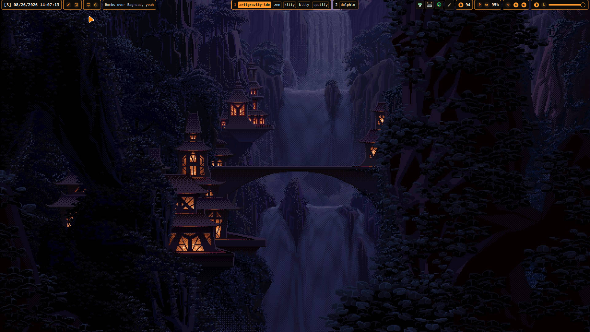
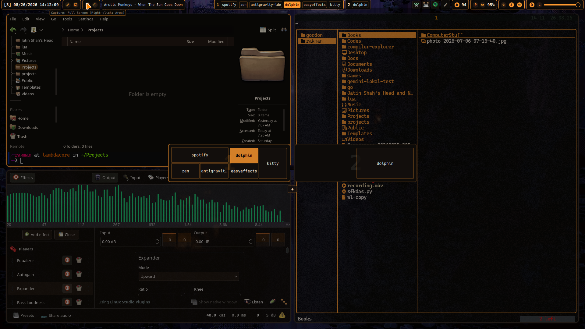
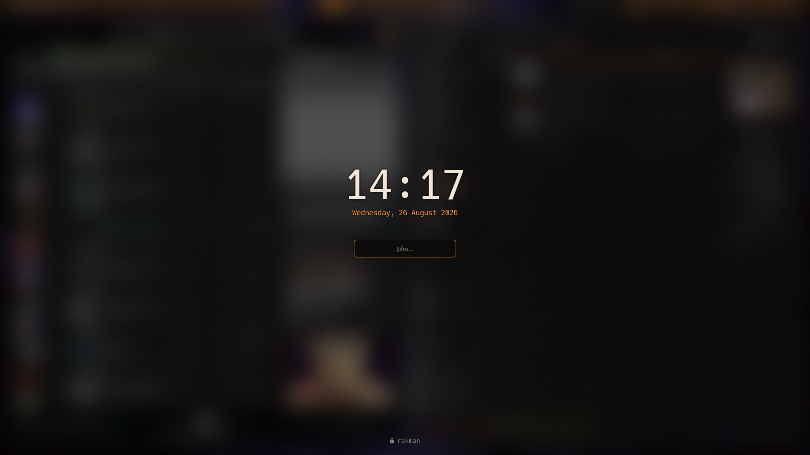
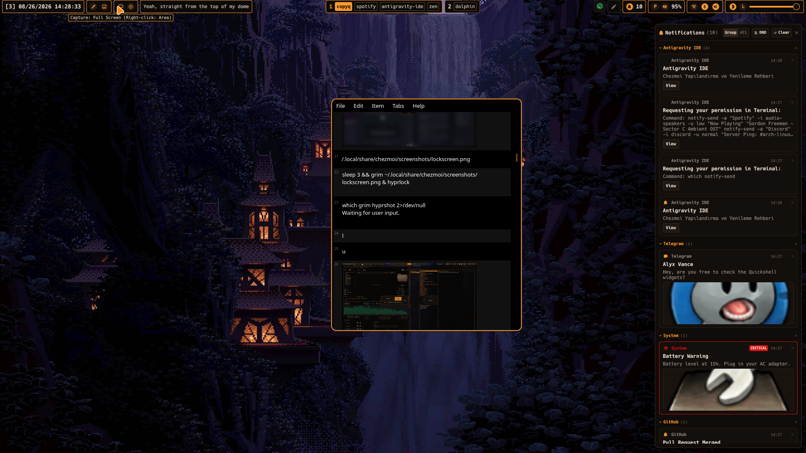
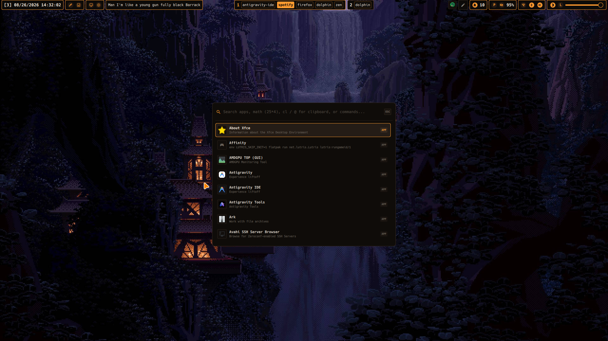
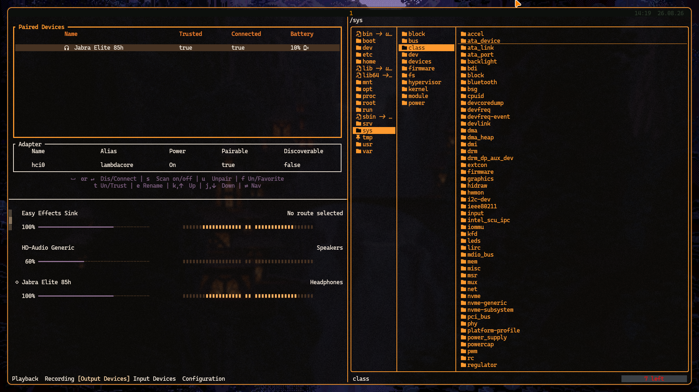

# 🌌 Dotfiles

Personal Arch Linux dotfiles powered by **Hyprland** and **Quickshell**, managed with **Chezmoi**.

---

## 📸 Screenshots

<div align="center">

### 🖥️ Desktop


<br>

| 🪟 Window Switcher | 🔒 Lockscreen |
| :---: | :---: |
|  |  |

| 🔔 Notifications & Cliphist | 🚀 Launcher & Notes |
| :---: | :---: |
|  |  |

### 💻 Terminal & Editor


</div>

---

## 🛠️ Stack & Components

- **OS:** Arch Linux
- **Compositor:** Hyprland (Lua)
- **Bar & Shell:** Quickshell (TopBar, Notifications, Switcher, Launcher)
- **Plugin:** `hypr-qswitcher-plugin` (C++)
- **Lockscreen:** `hyprlock` + `hypridle`
- **Display Manager:** SDDM (`amber-minimal`)
- **Theme:** Matugen (Material You)
- **Terminal:** Kitty
- **Editor:** Neovim
- **Shell:** Fish / Zsh
- **Multiplexer:** Zellij / Tmux
- **File Manager:** Yazi / Superfile
- **Clipboard:** CopyQ
- **Manager:** Chezmoi

---

## 🚀 Installation

```bash
chezmoi init --apply https://github.com/makrofaj67/dotfiles.git
```
