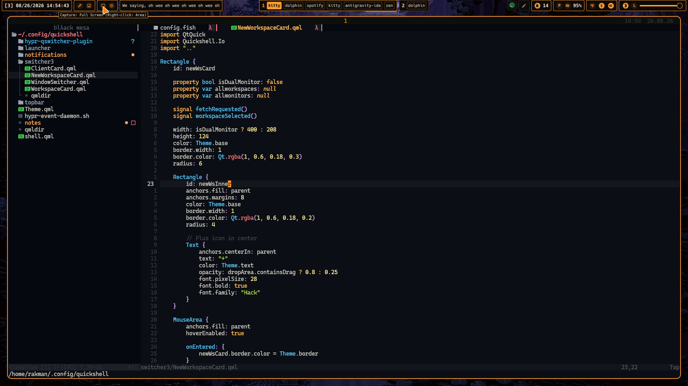

# Damnfiles

Personal Arch Linux dotfiles powered by **Hyprland** and **Quickshell**, managed with **Chezmoi**.

---

## Screenshots

<div align="center">

### Desktop


<br>

| Window Switcher | Lockscreen |
| :---: | :---: |
|  |  |
| **Notifications & Cliphist** | **Launcher & Notes** |
|  |  |
| **Terminal** | **Editor (Neovim)** |
|  |  |

</div>

---

## Stack & Components

- **OS:** Arch Linux
- **Compositor:** Hyprland (Lua)
- **Bar & Shell:** Quickshell (TopBar, Notifications, Switcher, Launcher, Notes)
- **Plugin:** `hypr-qswitcher-plugin` ([OC] C++)
- **Lockscreen:** `hyprlock` + `hypridle`
- **Display Manager:** SDDM
- **Qt Theme:** Darkly / hl-orange
- **GTK Theme:** Darkly-gtk / hl-orange
- **Terminal:** Kitty
- **Editor:** Neovim
- **Shell:** Fish
- **Multiplexer:** Zellij
- **File Manager:** Yazi
- **Clipboard:** CopyQ
- **Manager:** Chezmoi

---

## Installation

```bash
chezmoi init --apply https://github.com/makrofaj67/dotfiles.git
```
